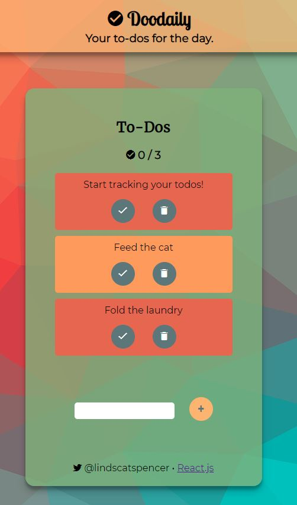

# Doodaily

> by @lindscatspencer (twitter) / @lindsayspencer (github)

This project was bootstrapped with [Create React App](https://github.com/facebook/create-react-app | ).

## Project Overview

Doodaily is the first web app I created using the JavaScript framework React.js, which uses ECMAScript 6 classes to establish inheritance between components and to ensure a one-way data flow. The app's functionality includes:

- Tracking the number of completed to-do items out of total number of items

- Items can be either or marked as completed or deleted. Items that are completed become crossed out.

- New items can be added with the submit form at the bottom

## Notes

I believe there is always a way to make an app or website better, so I wanted to include a list of things that can be improved in this project, even just for my own future reference.

- When an item is completed, sort it to the bottom of the list.
- Move the add item form to the top for easier access by the user.
- Add authorization.
- Experiment with a React Native version.
- Add ability to customize the UI.
